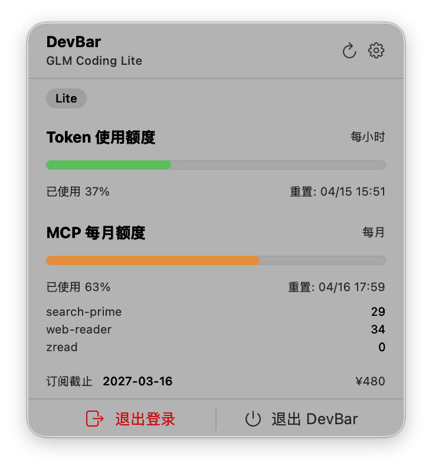

<p align="center">
  
</p>

<h1 align="center">DevBar（开发吧）</h1>

<p align="center">
  <strong>macOS 菜单栏工具，实时监控智谱 BigModel API 用量</strong><br>
  <a href="#installation">安装</a> · <a href="#features">功能</a> · <a href="#screenshots">预览</a> · <a href="#development">开发</a>
</p>

---

## 功能特性

- **菜单栏实时显示** — 在 macOS 菜单栏直接显示最高用量百分比
- **Token 用量监控** — 实时显示 Token 和时间的使用进度，颜色动态变化
- **MCP 使用明细** — 按模型分项展示 MCP 调用次数（search-prime、web-reader 等）
- **订阅状态管理** — 自动检测套餐有效性，显示订阅到期时间与续费价格
- **浏览器登录** — 系统浏览器扫码登录，安全且无需内嵌 WebView
- **自动刷新** — 支持 1/5/10/30 分钟定时刷新，关闭窗口自动暂停
- **Dock 栏控制** — 可设置不在 Dock 栏显示
- **可自定义图标** — 10 种 SF Symbol 图标可选

## 安装

### 从 Release 下载

下载最新的 `.dmg` 或 `.zip` 文件，将 DevBar 拖入 Applications 文件夹即可。

### 从源码构建

```bash
git clone https://github.com/xjpz/DevBar.git
cd DevBar
open DevBar.xcodeproj
```

在 Xcode 中选择 `My Mac` 作为运行目标，`Cmd + R` 构建运行。

**系统要求：** macOS 14.0+

## 使用方法

1. **登录** — 点击菜单栏图标 → 「在浏览器中登录」→ 在浏览器中扫码登录智谱 BigModel 账号 → 返回 DevBar 点击「已完成登录」
2. **查看用量** — 点击菜单栏图标展开面板，查看 Token / MCP 用量
3. **手动刷新** — 点击刷新按钮立即获取最新数据
4. **设置** — 点击齿轮图标，可切换图标、调整刷新间隔、控制 Dock 显示

## 预览



## 技术栈

- **SwiftUI** — 原生 macOS UI 框架
- **MenuBarExtra** — 菜单栏集成（`.window` 样式）
- **MVVM** — Models / Views / ViewModels 清晰分层
- **Keychain Services** — 安全存储认证凭据
- **URLSession** — HTTP API 请求

## 项目结构

```
DevBar/
├── DevBarApp.swift                # 应用入口，MenuBarExtra 配置
├── Models/
│   ├── AuthCredentials.swift      # 认证凭据（Token + Cookie）
│   ├── QuotaResponse.swift       # 用量 API 响应模型
│   └── SubscriptionResponse.swift # 订阅 API 响应模型
├── Services/
│   ├── BigModelAPIClient.swift   # 智谱 BigModel API 客户端
│   ├── AuthService.swift         # 认证状态管理
│   └── KeychainService.swift     # Keychain 存储服务
├── ViewModels/
│   ├── AppViewModel.swift        # 全局应用状态
│   └── QuotaViewModel.swift     # 用量数据与刷新逻辑
├── Views/
│   ├── MenuBarView.swift        # 主弹出面板
│   ├── LoginView.swift          # 浏览器登录引导
│   ├── QuotaRowView.swift       # 单项用量进度条
│   └── SettingsView.swift       # 设置面板
└── Utils/
    ├── Constants.swift          # API 地址、默认配置
    └── Extensions.swift         # 日期/字符串扩展
```

## API

| 接口 | 说明 | 频率 |
|------|------|------|
| `GET /api/biz/subscription/list` | 获取订阅列表 | 登录后调用一次 |
| `GET /api/monitor/usage/quota/limit` | 获取用量配额 | 定时刷新 |

认证方式：`Authorization` 请求头 + `bigmodel_token_production` Cookie。

## 配置

| 配置项 | 默认值 | 说明 |
|--------|--------|------|
| 自动刷新间隔 | 5 分钟 | 支持 1/5/10/30 分钟 |
| 菜单栏图标 | AppIcon | 支持 10 种 SF Symbol |
| Dock 栏显示 | 显示 | 可切换隐藏 |

## License

MIT License
